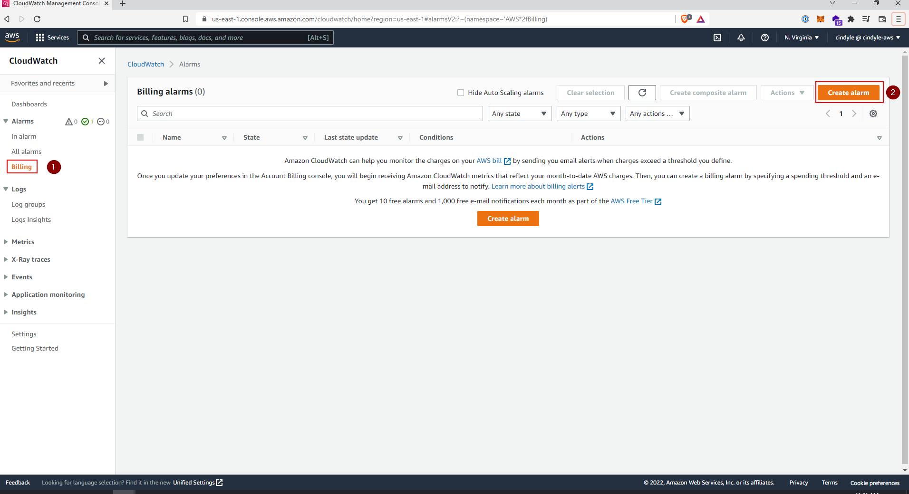
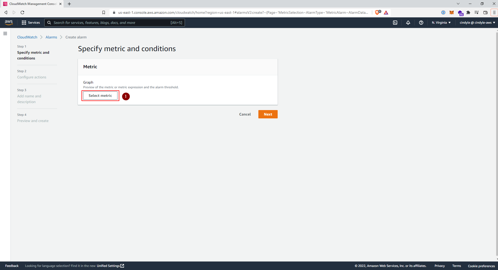
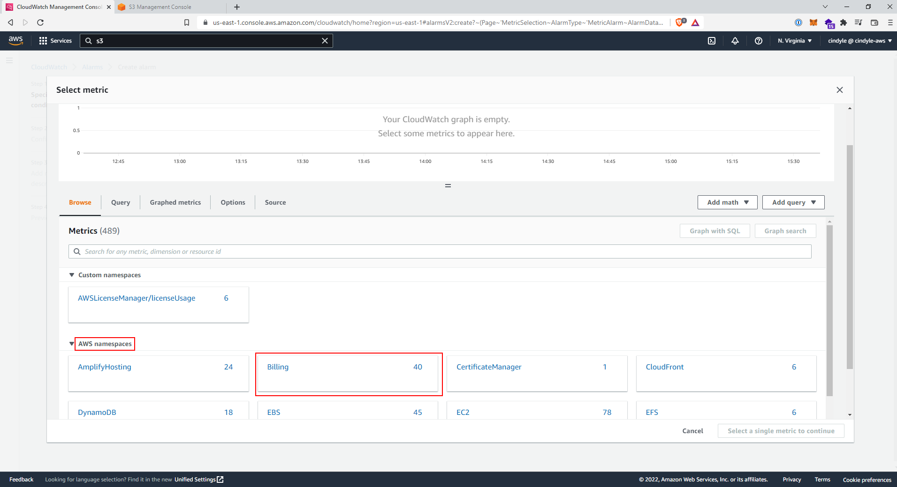
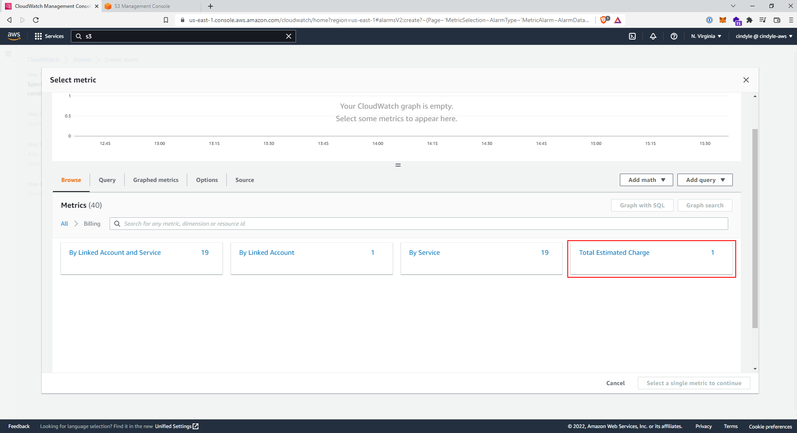
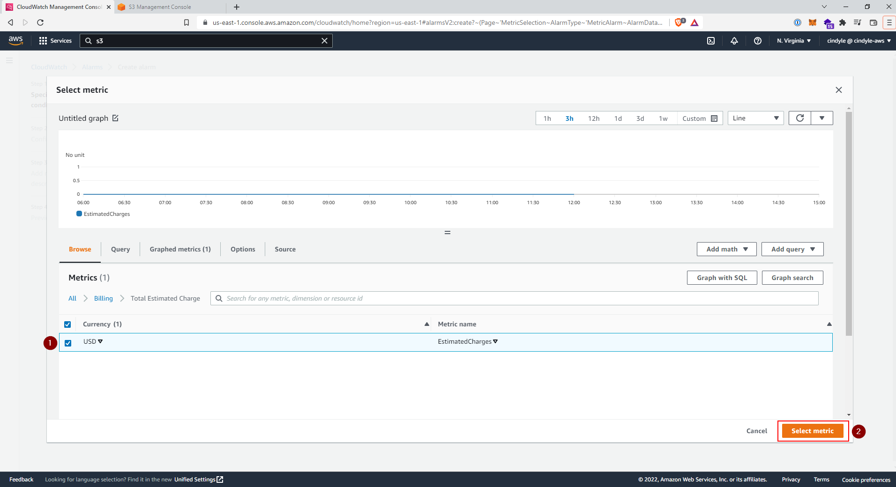
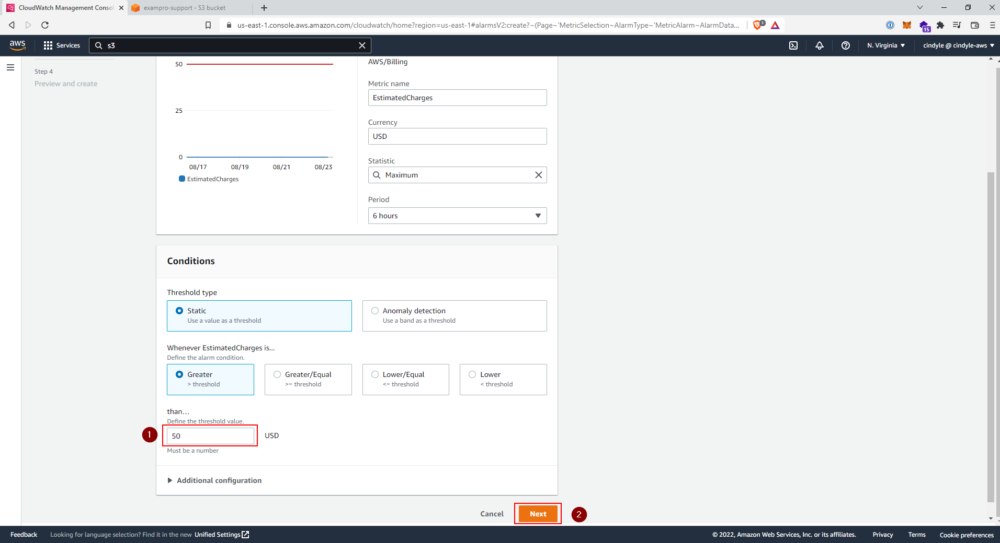
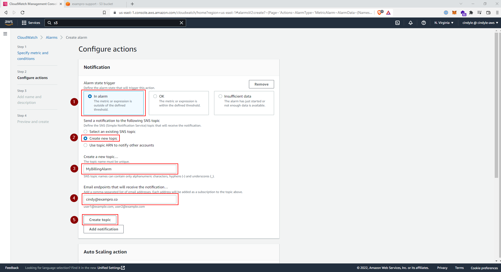
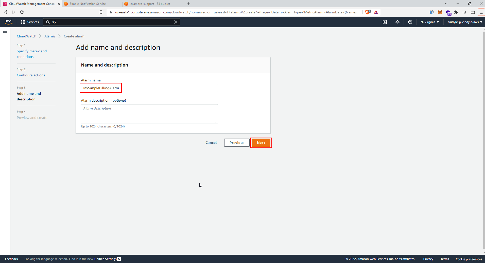

# Billing Alarm

* [X] Go to the CloudWatch Management Console, on the left-hand pane, select Billing,
and click on the Create Alarm button

  

* [X] Specify metric and conditions, click on the Select metric button

  

* [X] Under AWS namespaces, select Billing

  

* [X] Select Total Estimated Charge

  

* [X] Select USD and click on the Select metric

  

* [X] Set the threshold value to 50 and click Next*

  

* [X] In Step 2: Configure actions, enter the following details, and click on Create
  topic

    * Alarm state trigger: **In alarm**
    * Send a notification to the following SNS topic: **Create a new topic**
    * Create a new topic...: **MyBillingAlarm**
    * Email endpoints that will receive the notification: `user1@example.com`

  

* [X] Click on View in SNS Console, and you should see a Pending confirmation. Go to
  your email inbox and confirm the subscription. The status should update to
  Confirmed in the SNS Console*

* [X] In Step 3: Add name and description. Set the name to MySimpleBillingAlarm and
  click Next.

  

* [X] In Step 4: Preview and create. Click on Create Alarm
