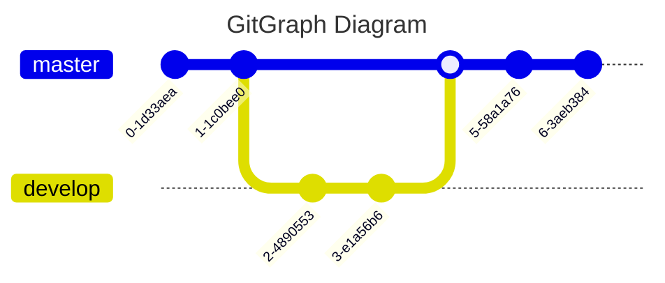

# Mermaid

Mermaid is a JavaScript based diagramming and charting tool that renders
Markdown-inspired text definitions to create and modify diagrams dynamically.

[Using Mermaid for each GitHub diagrams in Markdown-ish code](https://blog.jakelee.co.uk/using-mermaid-for-diagrams-on-github/)
gives comprehensive Mermaid cheatsheets for each Mermaid graph type.

This page includes Mermaid example diagrams.

## Class Diagram

## Entity Relationship Diagram

## Flow Chart

A flowchart is a type of diagram that represents an algorithm, workflow or
process. The flowchart shows the steps as boxes of various kinds, and their
order by connecting the boxes with arrows. This diagrammatic representation
illustrates a solution model to a given problem.

## Gaant Diagram

## GitGraph Diagram

## Pie Chart

## Sequence Diagram

## State Diagram

